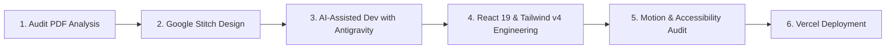

<div align="center">

  <h1>InAmigos Foundation — AI-Assisted Website Redesign</h1>
  <p><strong>An accessibility-focused, performance-optimized, and motion-enhanced conceptual NGO frontend prototype.</strong></p>

  <p>
    <a href="https://stitch.withgoogle.com/projects/14655895570667469697" target="_blank">
      
    </a>
    <a href="https://github.com/himanshu-jadhav108/IAF-Redesign" target="_blank">
      
    </a>
    
    
    
    
  </p>

</div>

---

## 📌 Project Overview

This repository contains a **conceptual redesign and functional frontend prototype** for **InAmigos Foundation**—a Section 8 registered non-profit organization based in Bilaspur, Chhattisgarh (Founder: Mr. Govind Shukla). 

Developed as part of an **AI Web Development Internship project**, this web application translates a comprehensive UX audit report and Google Stitch design concepts into a state-of-the-art, responsive, accessible, and interactive frontend built with **React 19**, **TypeScript**, **Tailwind CSS v4**, and **Framer Motion 13**.

> ⚠️ **Notice**: This project is a **conceptual frontend prototype** created for design-to-development evaluation and internship portfolio presentation. It is **not** the official production website of InAmigos Foundation.

---

## 📖 The Design-to-Development Journey

The development followed a real-world software engineering workflow:



### 1. Website Audit (`docs/Task_01_Website_Audit.pdf`)
The original web presence was thoroughly evaluated across:
- **UX & Visual Hierarchy**: Ambiguous donation options, fragmented volunteer links, missing institutional trust badges.
- **Accessibility & Mobile**: Inaccessible contrast, unlabeled form fields, missing ARIA indicators, and mobile viewport overflow.
- **Brand Story**: Lack of clarity around the 6 flagship initiatives (*Sewa, Bachpanshala, Jeev, Udaan, Prakriti, Vikas*).

### 2. Conceptual Design System (Google Stitch)
Visual tokens, surface colors, glassmorphism containers, and typography choices were synthesized in **Google Stitch**:
- 🔗 **Google Stitch Design Canvas**: [InAmigos Foundation Stitch Project](https://stitch.withgoogle.com/projects/14655895570667469697)
- **Primary Palette**: Deep Institutional Blue (`#003366`), Secondary Impact Green (`#006E25`), Warm Accent Orange (`#FF8C00`).
- **Typography**: Inter (Google Fonts) with optimized weight scale.

### 3. AI-Assisted Engineering
Using **Antigravity (Google DeepMind)** as an AI pair programmer, component specifications, accessible form systems, dark mode token maps, and Framer Motion pipelines were iteratively generated and verified against 0-lint and 0-type-error targets.

---

## ✨ Key Implemented Features

### 🎨 1. Persistent Light & Dark Theme System
- **Centralized Tokens**: CSS custom properties defined in `src/index.css` for page backgrounds, card surfaces, borders, text contrast, and brand accents.
- **Class-Based Tailwind v4 Engine**: Configured via `@variant dark (&:where(.dark, .dark *));`.
- **Zero-Flicker Persistence**: Preserves user preference in `localStorage` (`iamigos_theme`) and defaults gracefully to Light mode.
- **Navbar Toggle**: Smooth Sun/Moon theme toggle button with 30° rotation and icon crossfade animations.

### 🚀 2. Motion & Micro-Interaction System
- **GPU-Accelerated**: Exclusively animates `opacity` and `transform` properties (`translate3d`, `scale`) for 60fps rendering without layout reflows.
- **Scroll Progress Bar (`ScrollProgress.tsx`)**: An ultra-thin (2px) reading indicator fixed at the top of the viewport.
- **Scroll Reveal (`ScrollReveal.tsx`)**: Reusable viewport-aware container fading in elements (`y: 15px → 0`) upon scrolling into view.
- **Animated Counters (`AnimatedCounter.tsx`)**: Smooth 1.2s count-up animation for verified impact metrics (200+ volunteers, 28 states, 50,000+ beneficiaries).
- **Page Entry (`PageTransition.tsx`)**: Subtle 350ms route entry transition with 12px upward slide.
- **Reduced Motion Support**: Fully respects `@media (prefers-reduced-motion: reduce)` and Framer Motion `useReducedMotion()`.

### 🤖 3. AI Impact Assistant (`AIAssistant.tsx`)
- Interactive floating widget providing instant query answers for 80G tax receipts, flagship program details, volunteer onboarding steps, and founder details.
- Features typing indicator animations, quick prompt chips, and quick-action navigation shortcuts.

### 💳 4. Interactive 80G Donation Flow (`Donate.tsx`)
- One-Time vs. Monthly sustainer selector.
- Preset donation impact pills (₹500 to ₹5,000) with custom amount entry.
- Program direction selector (General Fund vs. Specific Cause).
- PAN Card collection for official 80G tax exemption certificates.
- Simulated Razorpay payment gateway checkout modal.

### 📝 5. Single Unified Volunteer Intake (`Volunteer.tsx`)
- Transparent 4-step onboarding timeline (*Application → Contact → Chapter Assignment → Fieldwork & Certificate*).
- Real-time client-side form validation with persistent floating labels and prototype confirmation state.

### 💬 6. Accessible FAQ Accordion (`About.tsx`)
- Framer Motion height expansion & collapse using `AnimatePresence` with 180° chevron icon rotation.

---

## 🛠️ Tech Stack & Dependencies

| Technology | Version | Purpose |
| :--- | :--- | :--- |
| **React** | `^19.2.8` | Core UI library with React 19 Concurrent Features |
| **Vite** | `^8.2.0` | Fast build tool & development server |
| **TypeScript** | `~6.0.2` | Strict static type checking and interface contracts |
| **Tailwind CSS** | `^4.3.3` | Utility-first CSS framework with native `@import` & `@variant` |
| **Framer Motion** | `^13.0.0` | Production motion engine for scroll reveals, transitions, and drawers |
| **React Router DOM** | `^7.18.2` | Client-side routing with `ScrollToTop` handling |
| **Lucide React** | `^1.30.0` | Accessible SVG icon set |
| **Oxlint** | `^1.75.0` | Ultra-fast JS/TS linter |

---

## 📂 Project Structure

```
d:\Projects\IAF Redesign/
├── docs/
│   └── Task_01_Website_Audit.pdf    # Source PDF audit report
├── public/
│   ├── favicon.svg                  # SVG favicon
│   └── icons.svg                    # SVG icon sprites
├── src/
│   ├── assets/                      # Static imagery & logos
│   ├── components/
│   │   ├── ai/
│   │   │   └── AIAssistant.tsx      # Floating AI impact chat drawer widget
│   │   ├── layout/
│   │   │   ├── Footer.tsx           # Canonical footer with verified social SVGs & legal info
│   │   │   └── Navbar.tsx           # Glassmorphic navbar with theme toggle & mobile drawer
│   │   └── ui/
│   │       ├── AnimatedCounter.tsx  # Viewport count-up animation for impact numbers
│   │       ├── Button.tsx           # Accessible pill button with motion hover/tap states
│   │       ├── EventCard.tsx        # Event card with date badge & action triggers
│   │       ├── Input.tsx            # Form Input & TextArea with persistent labels & error messages
│   │       ├── Modal.tsx            # Accessible backdrop modal dialog
│   │       ├── PageTransition.tsx   # Page navigation fade/slide transition wrapper
│   │       ├── ProgramCard.tsx      # Program card with cause icon & impact stats strip
│   │       ├── ScrollProgress.tsx   # Top reading progress indicator
│   │       ├── ScrollReveal.tsx     # Reusable viewport scroll reveal container
│   │       ├── TestimonialCard.tsx  # Quote card with avatar & verified badge
│   │       └── TrustBadges.tsx      # Section 8, 80G, 12A, CSR-1, NITI Aayog badges
│   ├── context/
│   │   └── ThemeContext.tsx         # Light & Dark theme state & localStorage manager
│   ├── data/
│   │   ├── eventsData.ts            # Verified upcoming & past drive events dataset
│   │   ├── faqData.ts               # Structured FAQ Q&A dataset
│   │   ├── galleryData.ts           # Fieldwork photography dataset
│   │   ├── organizationData.ts      # Address, contact, CIN, NITI Aayog ID, and stats
│   │   ├── programsData.ts          # 6 Flagship initiatives detailed dataset
│   │   ├── teamData.ts              # Founder & core team profile dataset
│   │   └── testimonialsData.ts      # Volunteer & beneficiary quote dataset
│   ├── pages/
│   │   ├── About.tsx                # Story, mission/vision, timeline, team, and FAQ
│   │   ├── Contact.tsx              # Verified office address, map info, and intake form
│   │   ├── Donate.tsx               # 80G tax receipt donation gateway selector
│   │   ├── Events.tsx               # Categorized upcoming & completed drive catalog
│   │   ├── Gallery.tsx              # Filterable fieldwork photo gallery & Lightbox modal
│   │   ├── Home.tsx                 # Hero, impact counters, flagship cards, testimonials
│   │   ├── Programs.tsx             # Detailed catalog for 6 flagship initiatives
│   │   └── Volunteer.tsx            # Onboarding steps & volunteer application form
│   ├── App.css
│   ├── App.tsx                      # Main React Router setup & ThemeProvider wrap
│   ├── index.css                    # Tailwind v4 import, theme tokens, & reduced-motion rules
│   └── main.tsx                     # DOM entry point
├── index.html                       # HTML5 template with Inter fonts & OpenGraph tags
├── package.json                     # Node dependencies & npm scripts
├── tsconfig.app.json                # TypeScript compiler config
└── vite.config.ts                   # Vite bundler & path alias (@) config
```

---

## 📄 Application Pages & Routes

| Route | Page Component | Key Functionality |
| :--- | :--- | :--- |
| `/` | `Home.tsx` | Staggered Hero, 4 Animated Impact Counters, 6 Flagship Cards, Testimonials, Drives |
| `/about` | `About.tsx` | Founding Story, Section 8 Credentials, Interactive Timeline, Team, Framer FAQ Accordion |
| `/programs` | `Programs.tsx` | Sub-brand Category Filter, Full Cause Descriptions, Key Interventions, Support Triggers |
| `/volunteer` | `Volunteer.tsx` | 4-Step Onboarding Sequence, Role Selection, Availability Selector, Validated Form |
| `/donate` | `Donate.tsx` | 80G Exemption Selector, Preset Impact Pills (₹500–₹5k), PAN Entry, Razorpay Simulation |
| `/events` | `Events.tsx` | Filterable Drives (Upcoming vs Completed), Date/Time/Location Badges, Sign-up CTAs |
| `/gallery` | `Gallery.tsx` | Filterable Fieldwork Grid, Image Hover Zoom, Accessible Lightbox Modal |
| `/contact` | `Contact.tsx` | Bilaspur Registered Office Details, Phone/Email Links, Direct Message Intake Form |

---

## 💻 Local Development Setup

### Prerequisites
- **Node.js**: `v18.0.0` or higher
- **npm**: `v9.0.0` or higher

### 1. Installation

```bash
# Clone the repository
git clone https://github.com/himanshu-jadhav108/IAF-Redesign.git

# Navigate into the project directory
cd IAF-Redesign

# Install dependencies
npm install
```

### 2. Environment Variables
> ℹ️ **Note**: No external API keys or environment variables are required to run this client-side frontend prototype locally.

### 3. Run Development Server

```bash
npm run dev
```
Open [http://localhost:5173](http://localhost:5173) in your browser to view the application.

### 4. Build for Production

```bash
npm run build
```
Compiles TypeScript types (`tsc -b`) and bundles production assets via Vite into the `dist/` directory.

### 5. Lint Codebase

```bash
npm run lint
```
Runs **Oxlint** for ultra-fast TypeScript and React code linting.

---

## 🌐 Deployment to Vercel

This repository is optimized for one-click deployment on **Vercel**:

1. Push your changes to GitHub.
2. Import `himanshu-jadhav108/IAF-Redesign` into Vercel Dashboard.
3. Configure Build Settings:
   - **Framework Preset**: `Vite`
   - **Build Command**: `npm run build`
   - **Output Directory**: `dist`
4. Deploy! Client-side routing is handled automatically.

---

## 🎨 Design System & Accessibility Specifications

### Color Tokens
- **Primary Navy**: `#003366` (Light) / `#38BDF8` (Dark Accent)
- **Primary Dark Navy**: `#001E40` (Light Headers) / `#0F172A` (Dark Background)
- **Secondary Impact Green**: `#006E25` (Light) / `#4ADE80` (Dark Accent)
- **Warm Accent Orange**: `#FF8C00` (Light CTA) / `#FB923C` (Dark CTA)

### Accessibility Compliance Highlights
- **Semantic Structure**: Strictly uses `<header>`, `<nav>`, `<main>`, `<section>`, `<article>`, and `<footer>`.
- **Keyboard Navigation**: Complete tab navigation support with custom outline focus rings on interactive elements.
- **Form Controls**: Every input field includes persistent `<label>` tags, explicit `htmlFor` pairings, and `aria-invalid` error messaging.
- **Heading Hierarchy**: Exactly one `<h1>` per page with sequential `<h2>` and `<h3>` tags.
- **Contrast Ratios**: Exceeds WCAG 2.1 AA standards for body text and interactive triggers in both Light and Dark modes.

---

## 🛡️ Project Status & Known Limitations

### Completion Status
- ✅ 8 Client-side pages built & verified
- ✅ Section 8, 80G, 12A, CSR-1, NITI Aayog trust credentials integrated
- ✅ Persistent Light & Dark Theme System
- ✅ Framer Motion interaction & reduced motion system
- ✅ Interactive AI Impact Assistant prototype
- ✅ Production build verified (0 TypeScript errors, 0 Vite warnings)

### Limitations & Future Scope
- **Payment Processing**: The donation gateway simulates the Razorpay checkout modal step and does not charge real currency.
- **Backend Storage**: Volunteer applications and contact form submissions operate in client-side prototype state without a live database.
- **Future Roadmap**: Potential integration with Headless CMS (Sanity/Strapi), Node.js/Express backend API for automated 80G PDF receipt generation, and real AI LLM endpoint integration.

---

## 🧑‍💻 Author

<div align="center">

  <h3>Himanshu Jadhav</h3>
  <p><strong>Artificial Intelligence & Data Science Engineer</strong></p>
  <p><em>Focused on building practical AI systems, intelligent applications, computer vision solutions, and high-performance software pipelines.</em></p>

  <p>
    <a href="https://github.com/himanshu-jadhav108" target="_blank">
      
    </a>
    <a href="https://www.linkedin.com/in/himanshu-jadhav-328082339" target="_blank">
      
    </a>
    <a href="https://himanshu-jadhav-portfolio.vercel.app/" target="_blank">
      
    </a>
    <a href="https://www.instagram.com/himanshu_jadhav_108" target="_blank">
      
    </a>
  </p>

</div>
